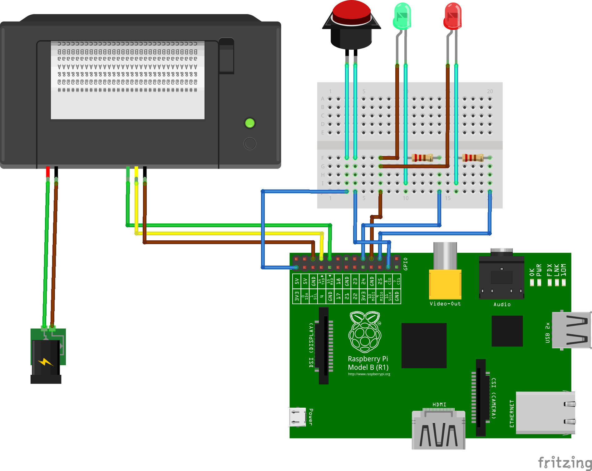

# Thermal Photobox

Instant Thermal Printer Photobox for low budget photos.

The thermal printer needs an extra power supply as it may use too much power at full load. The camera is a normal Raspberry Pi Camera Module v1.3. Other than that an arcade button and two normal LEDs are used for the interaction and visual feedback.

## Features

- led indicators
- advanced logging
- store pictures temporary or permanently
- configurable output path
- configurable image size
- annotate picture with text

## Circuit Wiring Diagram

## Related Links

- [Adafruit Thermal Printer Tutorial](https://learn.adafruit.com/networked-thermal-printer-using-cups-and-raspberry-pi/overview)
- [Raspberry Pi Camera Tutorial](https://projects.raspberrypi.org/en/projects/getting-started-with-picamera)
