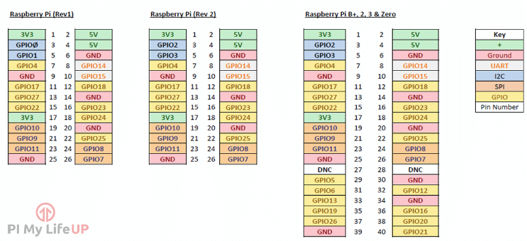

# Thermal Photobox

Lorem Ipsum

## Circuit Wiring Diagram

## Raspberry Pi GPIO Diagram

## Related Links

- [Adafruit Thermal Printer Tutorial](https://learn.adafruit.com/networked-thermal-printer-using-cups-and-raspberry-pi/overview)
- [Raspberry Pi Camera Tutorial](https://projects.raspberrypi.org/en/projects/getting-started-with-picamera)
